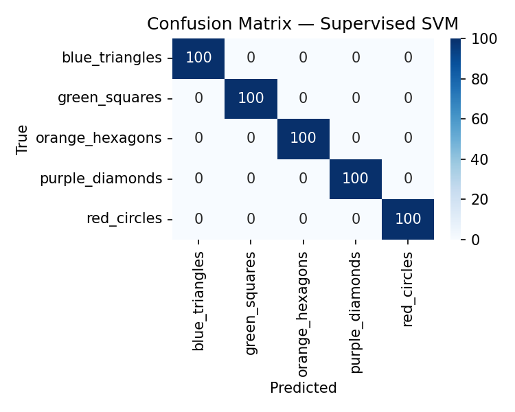
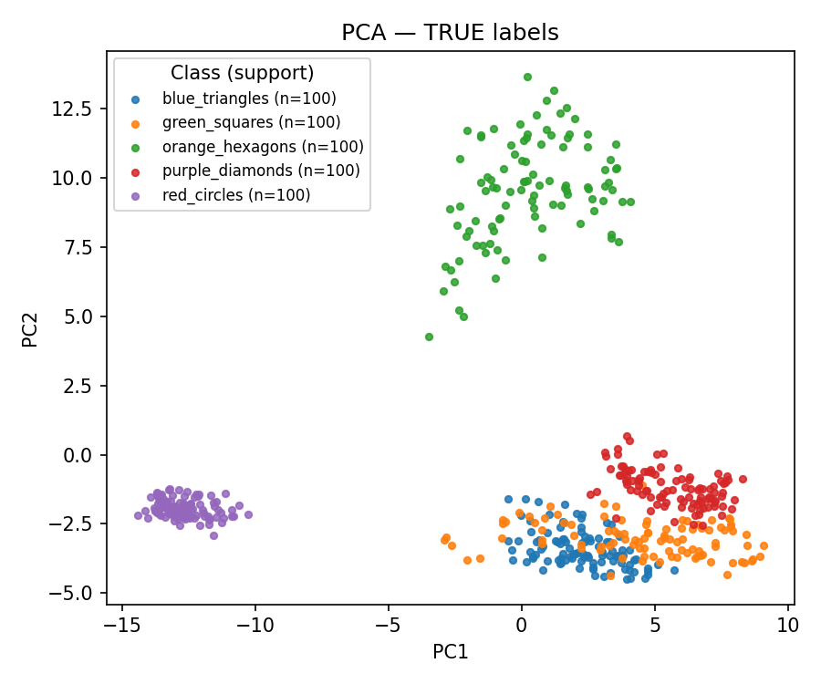
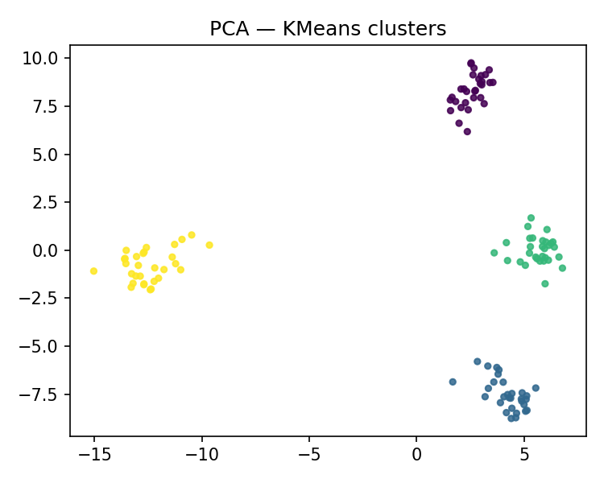

# Task 4 — Image Classification & Clustering

A complete Computer Vision project demonstrating and comparing **supervised** and **unsupervised** learning approaches on a synthetic geometric-shapes image dataset.

The project uses a **ResNet-18 feature extractor** to convert images into numerical embeddings and then applies:

* **Linear SVM** for supervised image classification
* **K-Means** for unsupervised clustering
* **PCA** for 2D feature visualization
* Standard classification and clustering metrics
* Automatically generated plots and reports

---

## Project Overview

The goal of this project is to compare supervised and unsupervised approaches while keeping the extracted image features identical.

The complete workflow is:

```text
Images
   │
   ▼
Resize to 224 × 224
   │
   ▼
ImageNet Normalization
   │
   ▼
ResNet-18 Feature Extraction
   │
   ├───────────────┐
   │               │
   ▼               ▼
Linear SVM       K-Means
   │               │
   ▼               ▼
Classification   Clustering
Metrics          Metrics
   │               │
   ▼               ▼
Confusion        PCA
Matrix           Visualization
```

This makes the comparison more meaningful because both approaches operate on the same feature representation.

---

# Dataset

The repository contains a synthetic dataset of geometric shapes.

## Classes

There are **5 classes**:

```text
blue_triangles
green_squares
orange_hexagons
purple_diamonds
red_circles
```

## Dataset Size

Each class contains:

| Split             | Images per Class | Total Images |
| ----------------- | ---------------: | -----------: |
| Train             |              100 |          500 |
| Validation        |              100 |          500 |
| Test              |              100 |          500 |
| **Total labeled** |          **300** |     **1500** |

The repository also contains:

```text
12 unlabeled inference images
```

inside:

```text
dataset/infer/
```

Therefore, the complete repository dataset contains:

```text
1500 labeled images
12 inference images
1512 images total
```

All labeled images are:

```text
256 × 256 pixels
```

---

# Dataset Structure

```text
dataset/
│
├── train/
│   ├── blue_triangles/
│   ├── green_squares/
│   ├── orange_hexagons/
│   ├── purple_diamonds/
│   └── red_circles/
│
├── val/
│   ├── blue_triangles/
│   ├── green_squares/
│   ├── orange_hexagons/
│   ├── purple_diamonds/
│   └── red_circles/
│
├── test/
│   ├── blue_triangles/
│   ├── green_squares/
│   ├── orange_hexagons/
│   ├── purple_diamonds/
│   └── red_circles/
│
└── infer/
    ├── sample_000.jpg
    ├── sample_001.jpg
    ├── ...
    └── sample_011.jpg
```

---

# Project Structure

```text
Task_4-main/
│
├── dataset/
│   ├── train/
│   ├── val/
│   ├── test/
│   └── infer/
│
├── scripts/
│   ├── train_supervised.py
│   ├── unsupervised_kmeans.py
│   └── analyze_and_report.py
│
├── metrics/
│   ├── supervised_metrics.json
│   └── unsupervised.json
│
├── outputs/
│   ├── cm_supervised.png
│   ├── pca_true.png
│   └── pca_kmeans.png
│
├── report/
│   └── REPORT.md
│
├── requirements.txt
├── run_all.bat
└── readME.md
```

---

# Methodology

## 1. Image Preprocessing

Before feature extraction, every image is resized to:

```text
224 × 224
```

The image is then converted to a PyTorch tensor.

ImageNet normalization is applied using:

```python
mean = [0.485, 0.456, 0.406]
std  = [0.229, 0.224, 0.225]
```

Processing pipeline:

```text
Original Image
      ↓
Resize (224 × 224)
      ↓
Convert to Tensor
      ↓
ImageNet Normalization
      ↓
ResNet-18
```

---

# Feature Extraction

The project uses **ResNet-18** from `torchvision`.

The final classification layer is removed, allowing the network to operate as a feature extractor.

Conceptually:

```text
Image
  ↓
ResNet-18 Convolutional Backbone
  ↓
Adaptive Average Pooling
  ↓
Flatten
  ↓
512-dimensional feature vector
```

The same ResNet-18 feature extraction approach is used by both the supervised and unsupervised pipelines.

This provides a fairer comparison between SVM classification and K-Means clustering.

---

## Pretrained ResNet-18

The scripts first attempt to load:

```python
models.ResNet18_Weights.DEFAULT
```

which corresponds to pretrained ImageNet weights.

If pretrained weights cannot be loaded, the code falls back to:

```python
models.resnet18(weights=None)
```

For results comparable to the included metrics, using the pretrained ResNet-18 weights is recommended.

---

# Supervised Learning

The supervised pipeline is implemented in:

```text
scripts/train_supervised.py
```

It combines:

```text
ResNet-18 Feature Extraction
          +
StandardScaler
          +
Linear Support Vector Machine
```

---

## Supervised Pipeline

```text
Training Images
      ↓
ResNet-18
      ↓
Feature Vectors
      ↓
StandardScaler
      ↓
LinearSVC
      ↓
Trained Classifier
      ↓
Test Images
      ↓
Predicted Classes
      ↓
Evaluation Metrics
```

The classifier is:

```python
LinearSVC(
    C=1.0,
    max_iter=5000
)
```

Feature scaling is performed using:

```python
StandardScaler(with_mean=False)
```

---

# Supervised Evaluation

The classifier is evaluated on the test dataset using:

* Accuracy
* Precision
* Recall
* F1-score
* Macro F1-score
* Weighted averages
* Per-class metrics
* Confusion matrix

Results are saved to:

```text
metrics/supervised_metrics.json
```

The confusion matrix is saved to:

```text
outputs/cm_supervised.png
```

---

# Supervised Results

The stored project results show:

| Metric      |     Result |
| ----------- | ---------: |
| Accuracy    | **1.0000** |
| Macro F1    | **1.0000** |
| Test Images |    **500** |

Every class achieved:

```text
Precision = 1.00
Recall    = 1.00
F1-score  = 1.00
```

for the included test dataset.

### Per-Class Results

| Class           | Precision | Recall |    F1 | Support |
| --------------- | --------: | -----: | ----: | ------: |
| Blue Triangles  |     1.000 |  1.000 | 1.000 |     100 |
| Green Squares   |     1.000 |  1.000 | 1.000 |     100 |
| Orange Hexagons |     1.000 |  1.000 | 1.000 |     100 |
| Purple Diamonds |     1.000 |  1.000 | 1.000 |     100 |
| Red Circles     |     1.000 |  1.000 | 1.000 |     100 |

---

# Confusion Matrix

The supervised model produced the following confusion matrix:



The perfect classification result is expected because the synthetic classes have visually distinctive combinations of shape and color.

---

# Unsupervised Learning

The unsupervised pipeline is implemented in:

```text
scripts/unsupervised_kmeans.py
```

It applies **K-Means clustering** to the same ResNet-18 image features.

---

## Unsupervised Pipeline

```text
Test Images
      ↓
ResNet-18
      ↓
Feature Vectors
      ↓
K-Means
      ↓
5 Clusters
      ↓
ARI / NMI
      ↓
PCA Visualization
```

The K-Means configuration is:

```python
KMeans(
    n_clusters=5,
    n_init=10,
    random_state=42
)
```

The number of clusters corresponds to the number of image classes.

---

# Clustering Metrics

Two standard clustering metrics are used.

## Adjusted Rand Index

The **Adjusted Rand Index (ARI)** measures similarity between the true class assignments and discovered clusters.

Typical interpretation:

```text
1.0  → perfect clustering
0.0  → approximately random clustering
<0   → worse than random agreement
```

Stored project result:

```text
ARI = 0.8643
```

---

## Normalized Mutual Information

**Normalized Mutual Information (NMI)** measures how much information the generated clusters share with the actual class labels.

Typical range:

```text
0.0 → no meaningful relationship
1.0 → perfect correspondence
```

Stored project result:

```text
NMI = 0.9031
```

---

# Unsupervised Results

| Metric                        |     Result |
| ----------------------------- | ---------: |
| Adjusted Rand Index           | **0.8643** |
| Normalized Mutual Information | **0.9031** |
| Number of Clusters            |      **5** |
| Test Samples                  |    **500** |

These results show that the ResNet-18 feature space already separates most geometric classes effectively even without training a classifier on class labels.

---

# Cluster Analysis

The generated K-Means clusters contain:

| Cluster | Size | Majority Class  | Majority Samples |
| ------- | ---: | --------------- | ---------------: |
| 0       |   68 | Green Squares   |               68 |
| 1       |  100 | Orange Hexagons |              100 |
| 2       |  103 | Blue Triangles  |              100 |
| 3       |  100 | Red Circles     |              100 |
| 4       |  129 | Purple Diamonds |              100 |

Several classes are separated almost perfectly.

The main overlap occurs between:

```text
green_squares
and
purple_diamonds
```

Some green-square samples are assigned to the cluster dominated by purple diamonds.

---

# PCA Visualization

Because ResNet-18 produces high-dimensional feature vectors, **Principal Component Analysis (PCA)** is used to project them into two dimensions.

The PCA representation is used only for visualization.

It is not used for training the SVM or K-Means models.

---

## PCA — True Classes



This visualization shows the ResNet-18 features colored according to their real class labels.

---

## PCA — K-Means Clusters



This visualization shows the same feature representation colored according to K-Means cluster assignments.

The plot also includes the calculated:

```text
ARI
NMI
```

values.

---

# Supervised vs Unsupervised Comparison

| Property                      | Supervised        | Unsupervised |
| ----------------------------- | ----------------- | ------------ |
| Method                        | Linear SVM        | K-Means      |
| Features                      | ResNet-18         | ResNet-18    |
| Uses class labels for fitting | Yes               | No           |
| Number of classes/clusters    | 5                 | 5            |
| Main metric                   | Accuracy / F1     | ARI / NMI    |
| Result                        | Accuracy = 1.0000 | ARI = 0.8643 |
| Additional result             | Macro F1 = 1.0000 | NMI = 0.9031 |

The supervised model performs better because it explicitly learns the relationship between feature vectors and known class labels.

K-Means does not receive class labels and must discover structure only from similarities within the ResNet feature space.

Despite this restriction, the clustering results remain strong.

---

# Installation

## Requirements

The project requires Python and the packages listed in:

```text
requirements.txt
```

Main dependencies:

* PyTorch
* torchvision
* scikit-learn
* matplotlib
* NumPy
* pandas
* Pillow
* tqdm
* seaborn

---

# Windows Installation

The easiest method is to use the included runner.

Open Command Prompt inside the project folder and run:

```bat
run_all.bat
```

or:

```bat
cmd /c run_all.bat
```

The script automatically:

```text
1. Creates a Python virtual environment
2. Updates pip
3. Installs project dependencies
4. Runs supervised classification
5. Runs unsupervised clustering
6. Generates the final report
```

---

# Manual Installation

Create a virtual environment:

```bash
python -m venv .venv
```

### Windows

Activate it:

```bat
.venv\Scripts\activate
```

Install the dependencies:

```bash
python -m pip install --upgrade pip
pip install -r requirements.txt
```

---

# Running the Project

## Supervised Classification

Run:

```bash
python scripts/train_supervised.py
```

The script generates:

```text
metrics/supervised_metrics.json
outputs/cm_supervised.png
```

---

## Unsupervised Clustering

Run:

```bash
python scripts/unsupervised_kmeans.py
```

The script generates:

```text
metrics/unsupervised.json
outputs/pca_true.png
outputs/pca_kmeans.png
```

---

## Generate Report

After running both ML pipelines:

```bash
python scripts/analyze_and_report.py
```

The generated report is stored at:

```text
report/REPORT.md
```

---

# Complete Pipeline

To manually execute the entire workflow:

```bash
python scripts/train_supervised.py
python scripts/unsupervised_kmeans.py
python scripts/analyze_and_report.py
```

---

# GPU Support

The scripts automatically detect CUDA:

```python
torch.device(
    "cuda" if torch.cuda.is_available() else "cpu"
)
```

If a CUDA-compatible GPU and supported PyTorch installation are available, ResNet-18 feature extraction will automatically use the GPU.

Otherwise, the project runs on the CPU.

---

# Output Files

After running the complete pipeline, the important results are stored in:

```text
outputs/
├── cm_supervised.png
├── pca_true.png
└── pca_kmeans.png
```

Metrics are stored in:

```text
metrics/
├── supervised_metrics.json
└── unsupervised.json
```

The summary report is stored in:

```text
report/
└── REPORT.md
```

---

# Technologies Used

### Programming

```text
Python
```

### Deep Learning

```text
PyTorch
torchvision
ResNet-18
```

### Machine Learning

```text
scikit-learn
Linear SVM
K-Means
PCA
StandardScaler
```

### Evaluation

```text
Accuracy
Precision
Recall
F1-score
Adjusted Rand Index
Normalized Mutual Information
Confusion Matrix
```

### Visualization

```text
Matplotlib
Seaborn
PCA
```

### Data Processing

```text
NumPy
Pandas
Pillow
```

---

# Key Features

* Complete supervised learning pipeline
* Complete unsupervised learning pipeline
* Shared ResNet-18 feature representation
* Five-class synthetic image dataset
* 1500 labeled images included
* Train, validation, and test datasets
* Additional inference samples
* Automatic CUDA detection
* SVM image classification
* K-Means clustering
* PCA feature visualization
* Confusion matrix generation
* JSON metrics export
* Automatic Markdown report generation
* One-click Windows execution

---

# Notes

The current supervised baseline uses:

```text
dataset/train/
```

for training and:

```text
dataset/test/
```

for final evaluation.

The included:

```text
dataset/val/
```

split is available for future model selection, hyperparameter tuning, or more advanced training experiments, but it is not currently used by the baseline scripts.

The images inside:

```text
dataset/infer/
```

are also included for future inference experiments but are not processed by the current training scripts.

---

# Reproducibility

K-Means uses:

```python
random_state=42
```

which improves reproducibility of the clustering experiment.

The project uses the same preprocessing pipeline and the same ResNet-18 feature extraction architecture for both supervised and unsupervised methods.

This ensures that the comparison mainly reflects the difference between:

```text
supervised classification
vs.
unsupervised clustering
```

rather than differences in feature extraction.

---

# Results Summary

The project demonstrates that pretrained deep neural-network features can be effectively reused by traditional machine-learning algorithms.

The supervised **Linear SVM** achieved:

```text
Accuracy:  1.0000
Macro F1: 1.0000
```

The unsupervised **K-Means** approach achieved:

```text
ARI: 0.8643
NMI: 0.9031
```

The results demonstrate strong separation of the synthetic geometric classes in the ResNet-18 feature space.

Supervised learning provides perfect classification on the included test set, while unsupervised clustering discovers most of the underlying class structure without using labels during clustering.

---

## Final Pipeline

```text
                         ┌─────────────────┐
                         │  Image Dataset  │
                         └────────┬────────┘
                                  │
                                  ▼
                         ┌─────────────────┐
                         │ Preprocessing   │
                         │    224 × 224    │
                         └────────┬────────┘
                                  │
                                  ▼
                         ┌─────────────────┐
                         │    ResNet-18    │
                         │ Feature Extract │
                         └────────┬────────┘
                                  │
                    ┌─────────────┴─────────────┐
                    │                           │
                    ▼                           ▼
           ┌─────────────────┐         ┌─────────────────┐
           │   Linear SVM    │         │     K-Means     │
           │   Supervised    │         │  Unsupervised   │
           └────────┬────────┘         └────────┬────────┘
                    │                           │
                    ▼                           ▼
           ┌─────────────────┐         ┌─────────────────┐
           │ Accuracy / F1   │         │    ARI / NMI    │
           │ Confusion Matrix│         │ PCA Visualization│
           └─────────────────┘         └─────────────────┘
```
